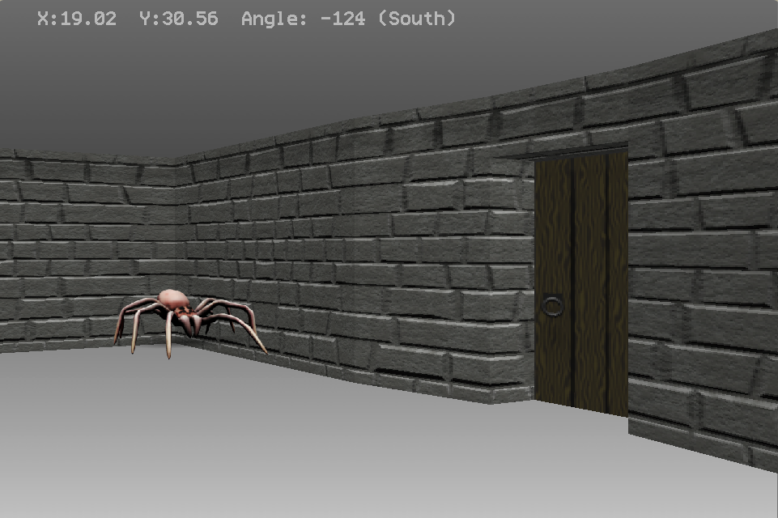

# Descent into Darkness
## a 3D(ish) realtime dungeon crawler for Mini Micro

This is a community project to develop a Doom-like fantasy RPG dungeon crawler using [MiniScript](https://miniscript.org/) and [Mini Micro](https://miniscript.org/MiniMicro).

## Getting Started

1. Clone (or better yet, fork and then clone) this repo to your local hard drive.
2. Mount the `usr` folder in slot 1 (`/usr`) of Mini Micro.
3. `cd "code"`
4. `reset; load "demo1"; run`

This will run the current demo.  From there you can navigate around the scene using the arrow or WASD keys, plus either mouse or Q/E to rotate.